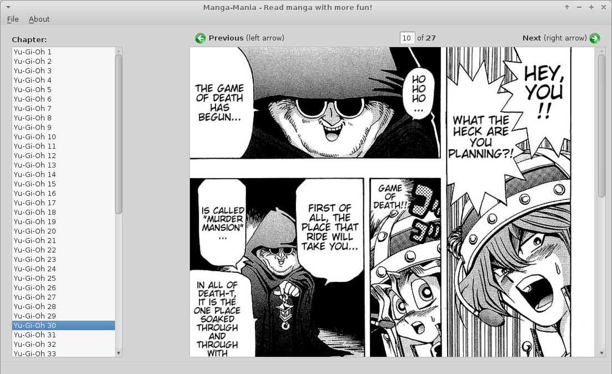

# Manga Mania

## What is Manga Mania

Manga-Mania is a simple desktop application for reading manga scraped from MangaFox (http://mangafox.me). It is written in `python3`, with the generous aid of `pyqt5`, `requests` and `beautiful-soup`.

Here's a humble screenshot of me reading Yu-Gi-Oh!

## Features

### Supported

* Advanced search functionality of MangaFox
* Read chapters sequentially/jump to particular pages

### Planned

* Add an 'history' feature, i.e., remember where the user last left off
* Improve UI (display app status, search results & chapter info in a more appealing way)
* Provide support for other popular manga sites like KissManga, Mangahere, etc.

---------------

**Legal**

*I am neither affiliated to the manga sites mentioned in this application, nor do I own any kind of rights to the manga these sites contain. I merely provide a medium to access from your desktop what is already reachable using a web browser. In no event shall I be held responsible for any kinds of damages, physical or intellectual, arising from the use of `Manga-Mania`. See LICENSE for licensing info.*
